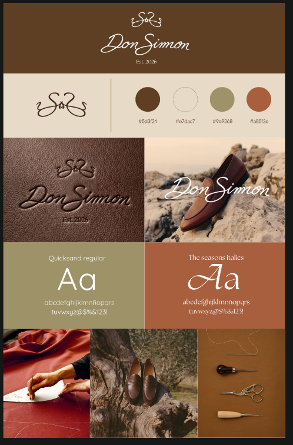

# 02 · Identidad de marca

## Logo

- **Monograma**: las iniciales "S" entrelazadas con trazos ornamentales tipo agujeta. Sirve como favicon, avatar de redes, sello y en el empaque.
- **Logotipo**: "Don Simon" en caligrafía, con "Est. 2026" debajo.
- Versiones que se necesitan: café sobre crema, crema/blanco sobre café o sobre fotografía, y monograma solo.
- **Pendiente**: archivos vectoriales (SVG) del monograma y el logotipo. No se debe usar el PNG del brand board en producción.

> El nombre oficial se escribe **"Don Simon", sin acento**, igual que en el logotipo, en todo el sitio y la comunicación. Ojo: el nombre podría cambiar por el conflicto con la marca de bebidas Don Simón (ver [decisiones pendientes](08-decisiones-pendientes.md#0-conflicto-de-nombre-y-registro-de-marca)).

## Paleta de color

| Token | Nombre | HEX | Uso principal |
|-------|--------|-----|---------------|
| `--color-cafe` | Café piel | `#5d3f24` | Texto principal, header/footer, botones primarios |
| `--color-crema` | Crema | `#e7dac7` | Fondo general del sitio |
| `--color-olivo` | Olivo | `#9e9268` | Fondos de sección, acentos secundarios, etiquetas |
| `--color-terracota` | Terracota | `#a85f3e` | Acento: CTA destacados, ofertas, estados activos |
| `--color-blanco` | Blanco | `#ffffff` | Tarjetas, texto sobre fotografía |

### Contraste (WCAG)

Mínimos: 4.5:1 para texto normal (AA) y 3:1 para texto grande (≥ 24px, o ≥ 18.66px en negritas).

| Combinación | Ratio | Uso permitido |
|-------------|-------|---------------|
| Café sobre crema | 6.93 | ✅ Cualquier texto |
| Café sobre blanco | 9.54 | ✅ Cualquier texto |
| Blanco sobre terracota | 4.80 | ✅ Cualquier texto (botones, badges) |
| Crema sobre terracota | 3.49 | ⚠️ Solo texto grande |
| Blanco sobre olivo | 3.10 | ⚠️ Solo texto grande (títulos) |
| Café sobre olivo | 3.07 | ⚠️ Solo texto grande |
| Crema sobre olivo | 2.25 | ❌ No usar para texto |
| Café sobre terracota | 1.99 | ❌ No usar para texto |

Regla práctica: **el texto de cuerpo va en café sobre crema/blanco**. El olivo y la terracota son para fondos con títulos grandes o para botones con texto blanco.

## Tipografía

| Rol | Fuente | Uso | Licencia |
|-----|--------|-----|----------|
| Display | **The Seasons** (Italic) | Títulos grandes, frases de marca, nombres de colección | Comercial: **hace falta comprar la licencia web** |
| Texto | **Quicksand** (Regular / Medium / SemiBold) | Cuerpo, navegación, botones, precios, formularios | Gratuita (Google Fonts, OFL) |

Lineamientos:
- The Seasons solo en tamaños grandes (≥ 32px). Nunca en párrafos, precios ni formularios.
- Quicksand en cuerpo a 16–18px mínimo; su trazo es delgado y a menor tamaño se lee mal sobre crema.
- Cargar las fuentes con `font-display: swap` y en formato WOFF2, auto-hospedadas.

Escala tipográfica sugerida (desktop / móvil):

| Nivel | Tamaño | Fuente |
|-------|--------|--------|
| Hero | 72 / 44 px | The Seasons Italic |
| H1 | 56 / 36 px | The Seasons Italic |
| H2 | 40 / 28 px | The Seasons Italic |
| H3 | 22 / 20 px | Quicksand SemiBold |
| Cuerpo | 18 / 16 px | Quicksand Regular |
| Pequeño / legal | 14 px | Quicksand Medium |
| Botón / etiqueta | 14 px, mayúsculas, tracking 0.08em | Quicksand SemiBold |

## Fotografía y dirección de arte

Según el brand board, hay tres tipos de imagen:

1. **Producto en contexto natural**: zapatos sobre piedra, madera vieja o tronco, con luz cálida de tarde. Para portada, colecciones y redes.
2. **Oficio / taller**: manos cortando piel, patrones, herramientas (lezna, tijeras, hilo). Para la historia de marca y como separadores entre secciones.
3. **Texturas**: piel con el logo grabado en seco. Para fondos, empaque y detalles.

Además, para el catálogo hace falta:

4. **Producto en fondo liso** (crema o blanco cálido), con los mismos ángulos para todos los modelos: lateral, 3/4, frontal, suela, detalle y par. Así la cuadrícula del catálogo se ve uniforme.

Especificaciones técnicas: proporción 4:5 para producto y 16:9 / 3:2 para editorial; exportar a ≥ 2000px del lado largo; el sitio las sirve en AVIF/WebP optimizadas.

## Tono de voz

- **Cálido y cercano**, sin caer en lo informal. Tuteo ("Encuentra tu talla").
- **Habla del oficio**: materiales, procesos, tiempo de trabajo. Hechos concretos en lugar de adjetivos vacíos.
- **Breve**: frases cortas, sobre todo en la interfaz.
- Ejemplos: "Hecho a mano, paso a paso." · "Piel que mejora con los años." · "Envío gratis a todo México."

## Elementos gráficos y UI

- Esquinas rectas o con radio mínimo (2–4px); nada redondeado tipo app.
- Líneas finas (1px, café al 30%) como divisores, igual que la línea vertical del brand board.
- Mucho espacio en blanco; secciones de color sólido que se alternan (crema → olivo → terracota) como en el brand board.
- Animaciones suaves y lentas (fade y desplazamiento corto). Nada de rebotes.
- Posible recurso gráfico: una línea tipo hilo o costura que conecta secciones.
